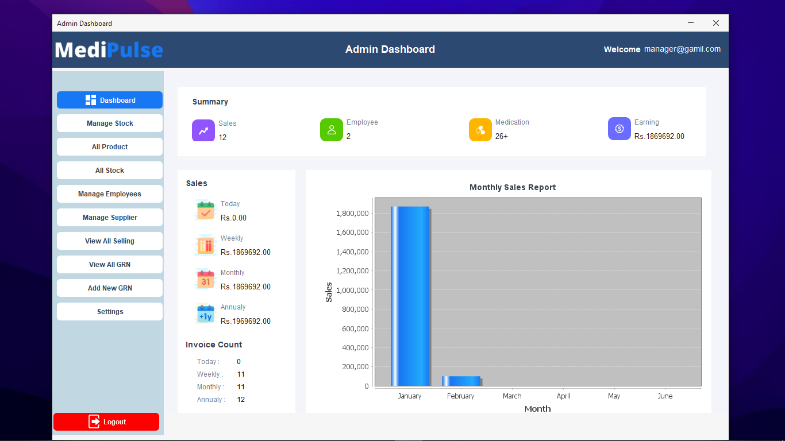

# MediPluse 💊

MediPluse is a **pharmacy management system** built using **Java ☕ and MySQL 🛢️**. It helps pharmacies efficiently manage inventory, employees, suppliers, sales, and invoices with a user-friendly dashboard.

---
## 🚀 Features

### 🔹 **Admin Dashboard**
- 📊 **Sales Summary** (Daily, Weekly, Monthly, Yearly)
- 📦 **Manage Stock** – Add, update, and track medicine inventory
- 👥 **Manage Employees & Suppliers**
- 📜 **View & Print Invoices**
- 📈 **Monthly Sales Report**
- 🔐 **User Authentication & Secure Access**
- 🔄 **Real-time Stock Updates**

### 🔹 **Cashier Dashboard**
- 🧾 **Generate & Print Bills**
- 📜 **View Invoice History**
- 🚀 **Fast & Easy Transactions**

---
## 🛠️ Tech Stack
- **Java (Swing/AWT) 🖥️** – GUI development
- **MySQL 🛢️** – Database management
- **JasperReports 📄** – Invoice printing
- **JDBC 🔗** – Database connectivity
- **JFreeChart 📊** – Chart generation
- **FlatLaf 🎨** – Modern UI look and feel
- **MySQL Workbench 🛠️** – Database management
- **HeidiSQL 📌** – SQL database administration

---
## 📸 Screenshots



---
## 🔧 Installation
1. **Clone the Repository:**
   ```sh
   git clone https://github.com/lakshithamadumal/MediPluse.git
   cd MediPluse
   ```
2. **Set up MySQL Database:**
   - Import the provided SQL file into MySQL.
   - Update database credentials in `MySQL.java`.
3. **Run the Application:**
   - Compile the Java files using `javac`.
   - Run the main class:
     ```sh
     java Main
     ```

---
## 📜 License
This project is **open-source** and available under the **MIT License**.

---
## 🤝 Contributing
Contributions are welcome! Feel free to **fork** this repository and submit a **pull request**.

---
## 📧 Contact
For any queries, contact me at **mandujayaweera2003@gmail.com**.
